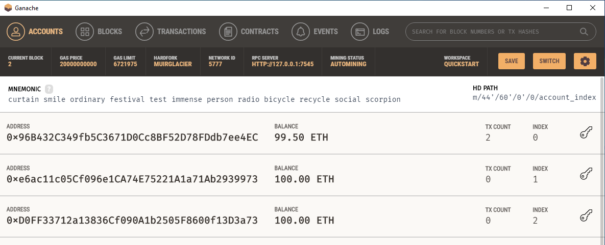
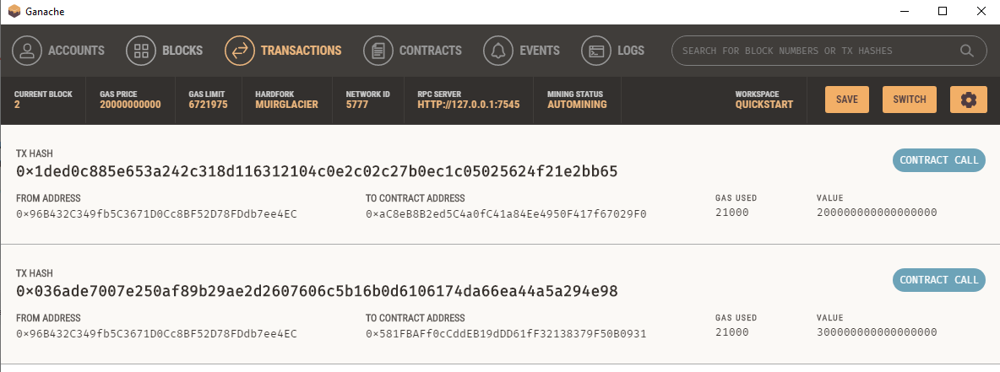
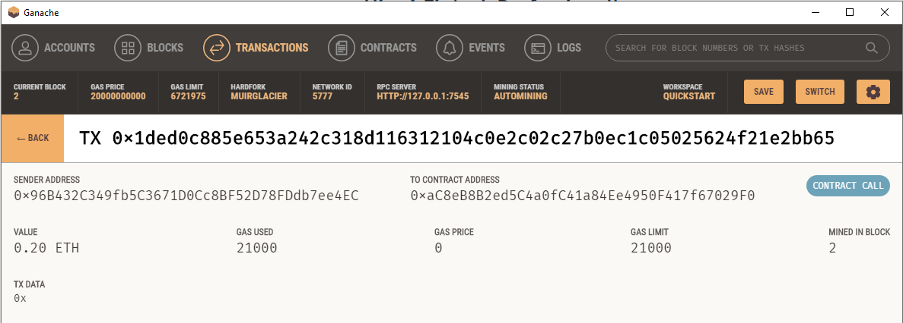

# Ethereum Transactions with Ganache


This ethereum blockchain based application is used to generate payments to FinTech professional for their services.
---

## Technologies

This application utilizes the following technologies:

**[Python 3.7](https://www.python.org/downloads/release/python-370/)**

**[Pandas](https://pandas.pydata.org/)** 

**[Streamlit](https://streamlit.io/)** 

**[Web3.py](https://web3py.readthedocs.io/en/stable/overview.html)**

**[Mnemonic](https://pypi.org/project/mnemonic/)**

**[bip44](https://pypi.org/project/bip44/)**

**[Ganacge](https://trufflesuite.com/ganache/)**

**Dataclasses Library** 

**Typing Library**

---

## Installation Guide

```python
pip install pandas
```
```python
pip install streamlit
```
```python
pip install web3==5.17
```
```python
pip install mnemonic
```
```python
pip install bip44
```
```python
pip install python-dotenv
```

---

## Usage

To use the application, clone the repository and run the **fintech_finder.py** file in streamlit with the following code:

```python
streamlit run fintech_finder.py
```

To use the application:
1) Select a fintech professional from the list, review their hourly rates,

2) enter the number of work hours required for the selected professional, and for which they will be paid,

3) calculate the professional's pay based on their rate and the desired number of hours of work, 

4) send the payment in ether to the professional upon completion of work, 

The app user can review the transcation history, balances, transaction details, and receipient address balance & history in Ganache:







---
 
## Contributors

**Contributor:** Lindsey Hardouin<br>
**Email Address:** lindseyhardouin@gmail.com<br>